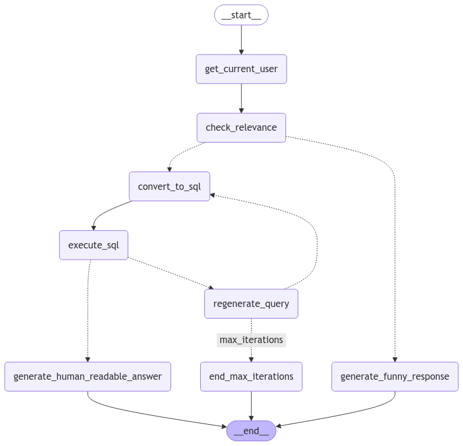

# NL to SQL Food Ordering Agent

This project demonstrates an AI food ordering agent that translates natural language requests into SQL queries for interacting with a database. It leverages LangChain for natural language processing and LangGraph for workflow management.

## Overview

This project provides a practical example of building a conversational agent that can understand natural language and execute SQL queries.  Users can ask questions about food items, place orders, and manage their orders. The agent uses a large language model (LLM) from Groq to interpret user input, convert it to SQL, and then execute the SQL against a database.  

## Features

- **Natural Language Understanding:** Users can interact with the agent using natural language.
- **SQL Query Generation:** The agent automatically converts natural language requests into SQL queries.
- **Database Interaction:** The agent executes SQL queries against a database to retrieve and manage data.
- **Human-Readable Responses:** The agent provides clear and concise responses in natural language.
- **Error Handling:** The agent handles invalid requests and SQL errors gracefully.
- **Query Regeneration:** The agent can regenerate SQL queries if the initial attempt fails.

